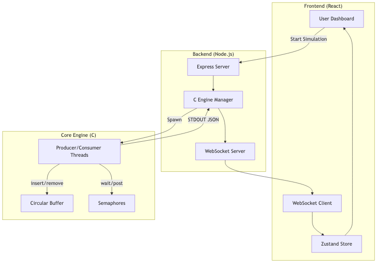

# Project Report: Real-Time Process Synchronization Simulator

## 1. Project Overview
The **Real-Time Process Synchronization Simulator** is a high-fidelity academic project designed to solve and visualize the classic **Producer-Consumer Problem**. The system demonstrates how multiple concurrent threads can share a bounded resource (a circular buffer) safely using **POSIX Semaphores**. By providing a real-time, glassmorphic dashboard, the project makes abstract operating system concepts like mutual exclusion, race conditions, and deadlocks tangible and easy to understand.

## 2. Module-Wise Breakdown
- **Core Engine (C)**: Implements the low-level synchronization logic using `pthreads` and `semaphores`. It handles thread creation, buffer management, and thread-safe JSON logging.
- **Backend Orchestrator (Node.js)**: Acts as a bridge, spawning the C engine as a child process and streaming its output to the web via WebSockets.
- **Frontend Dashboard (React)**: A modern, real-time visualization layer built with Vite, Tailwind CSS v4, and Framer Motion. It provides a "Mission Control" interface for monitoring every thread's state and buffer activity.

## 3. Functionalities
- **Live Visualization**: Real-time animation of producers generating data and consumers removing it.
- **Semaphore Monitoring**: Dynamic gauges tracking the values of `mutex`, `empty`, and `full` semaphores.
- **Thread Lifecycle Tracking**: A dedicated glossary and live indicators for thread states (Running, Waiting, Blocked, Idle).
- **Performance Analytics**: Real-time throughput (ops/sec) and buffer utilization charts.
- **System Configuration**: Fine-grained control over thread counts, buffer size, and execution speed.
- **Presentation Mode**: A "Cinema View" that maximizes the visualization for demonstrations by hiding UI controls.

## 4. Technology Used
### • Programming Languages:
- **C**: For the core high-performance synchronization engine.
- **JavaScript (ES6+)**: For the backend server and frontend dashboard.

### • Libraries and Tools:
- **C Libraries**: `pthread.h`, `semaphore.h` (POSIX), `stdio.h`.
- **Node.js**: `Express` (REST API), `ws` (WebSockets).
- **Frontend**: `React.js`, `Zustand` (State Management), `Framer Motion` (Animations), `Recharts` (Analytics).
- **Styling**: `Tailwind CSS v4` with glassmorphism design tokens.

### • Other Tools:
- **GitHub**: Used for version control, branch management, and revision tracking.
- **Make**: For automated compilation of the C engine.
- **Vite**: For high-performance frontend building and hot-reloading.

## 5. Flow Diagram


## 6. Revision Tracking on GitHub
- **Repository Name**: mobin2706/Process-Synchronization-Simulator
- **GitHub Link**: [https://github.com/mobin2706/Process-Synchronization-Simulator](https://github.com/mobin2706/Process-Synchronization-Simulator)

## 7. Conclusion and Future Scope
The project successfully achieves its goal of providing a robust, visually engaging platform for learning process synchronization. The use of a multi-tier architecture (C/Node/React) ensures both performance and a premium user experience.
**Future Scope**:
- Implementation of **Priority-based Scheduling** for threads.
- Support for **Reader-Writer** and **Dining Philosophers** problems.
- Cloud deployment for remote collaboration and shared classroom demos.

## 8. References
- Silberschatz, A., Galvin, P. B., & Gagne, J. (2018). *Operating System Concepts*.
- Tanenbaum, A. S., & Bos, H. (2014). *Modern Operating Systems*.

---

# Appendix

## A. AI-Generated Project Elaboration/Breakdown Report
The project follows a **Real-Time Data Streaming Architecture**. The C Engine operates as a "Source of Truth," generating discrete synchronization events. These events are parsed by the Node.js layer which acts as a "Stream Transformer," converting raw process output into JSON packets. Finally, the React Frontend serves as a "Reactive Consumer," mapping these JSON packets to complex UI animations in under 16ms, ensuring a fluid 60fps visualization.

## B. Problem Statement
The **Producer-Consumer Problem** (or Bounded-Buffer Problem) is a classic example of a multi-process synchronization problem. The problem describes two processes, the producer and the consumer, who share a common, fixed-size buffer used as a queue. The producer's job is to generate data and put it into the buffer. At the same time, the consumer is consuming the data (i.e. removing it from the buffer), one piece at a time. The problem is to make sure that the producer won't try to add data into the buffer if it's full and that the consumer won't try to remove data from an empty buffer.

## C. Solution/Code:
### 1. C Core Engine (`main.c`)
```c
// [main.c content]
// Handles thread orchestration and semaphore initialization
```

### 2. Synchronization Logic (`producer.c` & `consumer.c`)
```c
// [producer.c]
sem_wait(empty);
sem_wait(mutex);
// CRITICAL SECTION
buffer_insert(val);
sem_post(mutex);
sem_post(full);
```

### 3. Backend Bridge (`server.js`)
```javascript
// [server.js]
// Spawns C engine and broadcasts events via WebSocket
```

### 4. Frontend Layout (`App.jsx`)
```javascript
// [App.jsx]
// Implements the high-fidelity 12x12 grid and Presentation Mode
```

*(For full code listing, please refer to the attached source files in the repository)*
