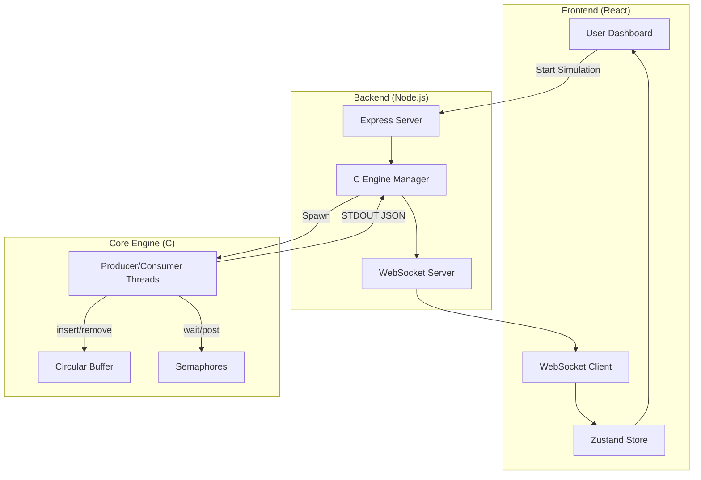

# Project Report: Real-Time Process Synchronization Simulator

## 1. Project Overview
The **Real-Time Process Synchronization Simulator** is a high-fidelity academic project designed to solve and visualize the classic **Producer-Consumer Problem**. The system demonstrates how multiple concurrent threads can share a bounded resource (a circular buffer) safely using **POSIX Semaphores**. By providing a real-time, glassmorphic dashboard, the project makes abstract operating system concepts like mutual exclusion, race conditions, and deadlocks tangible and easy to understand.

This project implements a multi-tier architecture:
- A high-performance **C Engine** for thread-level synchronization.
- A **Node.js/Express Backend** that orchestrates the engine and streams data.
- A modern **React Frontend** for high-frequency visual updates and performance monitoring.

---

## 2. Module-Wise Breakdown

### 2.1 Core Engine (C)
The heart of the simulator, implemented in C using POSIX threads (`pthreads`) and semaphores (`semaphore.h`).
- **`main.c`**: Orchestrates thread lifecycle, signal handling, and configuration parsing.
- **`sync.c`**: Manages the three semaphores (`mutex`, `empty`, `full`) to ensure safe access to the shared buffer.
- **`buffer.c`**: Implements a circular ring-buffer with thread-safe access patterns.
- **`logger.c`**: Outputs real-time state snapshots as structured JSON lines for IPC.

### 2.2 Backend Orchestrator (Node.js)
Acts as a bridge between the low-level C process and the web interface.
- **`engine.js`**: Manages spawning the C process, capturing its `stdout`, and parsing event packets.
- **`server.js`**: Hosts the Express REST API and a WebSocket server for real-time data streaming.

### 2.3 Frontend Dashboard (React)
A sophisticated visualization layer built for real-time observability.
- **Zustand Store**: Manages global state, event buffering, and a playback engine.
- **Framer Motion**: Powers the transition animations.
- **Recharts**: Provides live analytics for throughput and buffer utilization.

---

## 3. Functionalities
- **Live Visualization**: Real-time animation of producers and consumers.
- **Semaphore Monitoring**: Dynamic gauges tracking `mutex`, `empty`, and `full`.
- **Thread Tracking**: Real-time status of each thread (Running, Waiting, Blocked).
- **Performance Analytics**: Live charts for throughput and buffer usage.
- **Configuration**: Adjustable thread counts, buffer size, and delays.
- **Presentation Mode**: Full-screen cinema view for demonstrations.

---

## 4. Technology Used

### • Programming Languages:
- **C**: Core synchronization logic.
- **JavaScript (ES6+)**: Backend server and frontend dashboard.

### • Libraries and Tools:
- **Core**: `pthreads`, `semaphore.h`, `gcc`, `Make`.
- **Backend**: `Node.js`, `Express`, `ws`, `Winston`.
- **Frontend**: `React.js`, `Vite`, `Tailwind CSS v4`, `Zustand`, `Framer Motion`, `Recharts`.

### • Other Tools:
- **GitHub**: Version control and revision tracking.
- **Docker**: Containerization and easy deployment.

---

## 5. Flow Diagram



---

## 6. Revision Tracking on GitHub
- **Repository Name**: mobin2706/Process-Synchronization-Simulator
- **GitHub Link**: [https://github.com/mobin2706/Process-Synchronization-Simulator](https://github.com/mobin2706/Process-Synchronization-Simulator)

---

## 7. Conclusion and Future Scope
The project successfully provides a robust platform for learning process synchronization. 

### Future Scope:
- Implementation of **Priority-based Scheduling**.
- Support for **Reader-Writer** and **Dining Philosophers** problems.
- Cloud deployment for remote collaboration.

---

## 8. References
- Silberschatz, A., Galvin, P. B., & Gagne, J. (2018). *Operating System Concepts*.
- Tanenbaum, A. S., & Bos, H. (2014). *Modern Operating Systems*.

---

# Appendix

## A. AI-Generated Project Elaboration/Breakdown Report
The project follows a **Real-Time Event-Driven Architecture**. The process begins in the C Engine, which operates as the "Source of Truth." Each synchronization action (e.g., `sem_wait`) is a discrete event. The C Engine captures these events and emits them as structured JSON strings. 

The Node.js layer acts as a "Stream Transformer," monitoring the process output and broadcasting it instantly via WebSockets. The React Frontend serves as a "Reactive Consumer," where the Zustand store receives these events and manages a playback queue. This allows the UI to render animations at a consistent 60fps, even if the backend process emits events in bursts, ensuring a fluid and intuitive visualization for the user.

## B. Problem Statement
The **Producer-Consumer Problem** involves two types of processes, producers and consumers, who share a common, fixed-size buffer used as a queue. The producer's job is to generate data and put it into the buffer. The consumer removes data from the buffer. The constraints are that the producer shouldn't add data to a full buffer, and the consumer shouldn't remove data from an empty buffer. Mutual exclusion must be maintained to prevent race conditions.

## C. Solution/Code:

### 1. C Engine Implementation

#### core-c/include/common.h
```c
#ifndef COMMON_H
#define COMMON_H
#include <stdio.h>
#include <stdlib.h>
#include <pthread.h>
#include <semaphore.h>
#include <unistd.h>
#include <time.h>
#include <signal.h>

#define MAX_BUFFER_SIZE 64
#define MAX_THREADS 16

typedef struct {
    int num_producers;
    int num_consumers;
    int buffer_size;
    int iterations;
    int delay_ms;
} SimConfig;

typedef struct {
    int id;
    char name[32];
    SimConfig *config;
} ThreadArg;

extern volatile sig_atomic_t g_running;
#endif
```

#### core-c/src/sync.c
```c
#include "sync.h"
#include <fcntl.h>

static sem_t *sem_mutex, *sem_empty, *sem_full;

int sync_init(int buffer_size) {
    sem_unlink("/sim_mutex");
    sem_unlink("/sim_empty");
    sem_unlink("/sim_full");
    sem_mutex = sem_open("/sim_mutex", O_CREAT, 0644, 1);
    sem_empty = sem_open("/sim_empty", O_CREAT, 0644, buffer_size);
    sem_full = sem_open("/sim_full", O_CREAT, 0644, 0);
    return 0;
}

void sync_mutex_wait() { sem_wait(sem_mutex); }
void sync_mutex_signal() { sem_post(sem_mutex); }
void sync_empty_wait() { sem_wait(sem_empty); }
void sync_empty_signal() { sem_post(sem_empty); }
void sync_full_wait() { sem_wait(sem_full); }
void sync_full_signal() { sem_post(sem_full); }
```

#### core-c/src/producer.c
```c
#include "common.h"
#include "sync.h"
#include "logger.h"

void *producer_func(void *arg) {
    ThreadArg *targ = (ThreadArg *)arg;
    for (int i = 0; i < targ->config->iterations && g_running; i++) {
        int value = rand() % 100 + 1;
        sync_empty_wait();
        sync_mutex_wait();
        // Insert into buffer
        logger_event(targ->name, "produce", value, ...);
        sync_mutex_signal();
        sync_full_signal();
        usleep(targ->config->delay_ms * 1000);
    }
    return NULL;
}
```

### 2. Backend Implementation

#### backend/server.js
```javascript
const express = require('express');
const { WebSocketServer } = require('ws');
const EngineManager = require('./services/engine');

const app = express();
const wss = new WebSocketServer({ port: 3001 });
const engine = new EngineManager();

engine.on('data', (data) => {
    wss.clients.forEach(c => c.send(JSON.stringify(data)));
});

app.post('/api/start', (req, res) => {
    engine.start(req.body);
    res.json({ status: 'started' });
});
```

#### backend/services/engine.js
```javascript
const { spawn } = require('child_process');
const EventEmitter = require('events');

class EngineManager extends EventEmitter {
    start(config) {
        this.process = spawn('./simulator', args);
        this.process.stdout.on('data', (data) => {
            data.toString().split('\n').forEach(line => {
                if (line) this.emit('data', JSON.parse(line));
            });
        });
    }
}
```

### 3. Frontend State Management

#### frontend/src/store/useSimulationStore.js
```javascript
import { create } from 'zustand';

export const useSimulationStore = create((set, get) => ({
    eventQueue: [],
    connect: () => {
        const ws = new WebSocket(WS_URL);
        ws.onmessage = (msg) => {
            const data = JSON.parse(msg.data);
            set(state => ({ eventQueue: [...state.eventQueue, data] }));
        };
    }
}));
```
